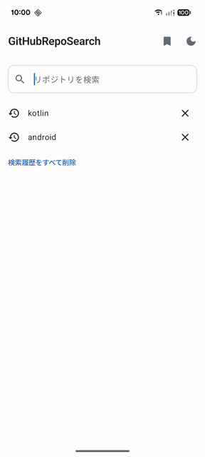
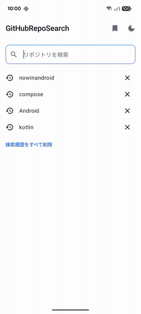
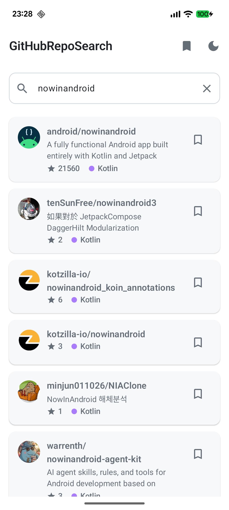
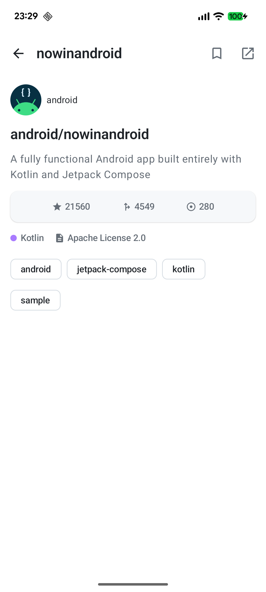
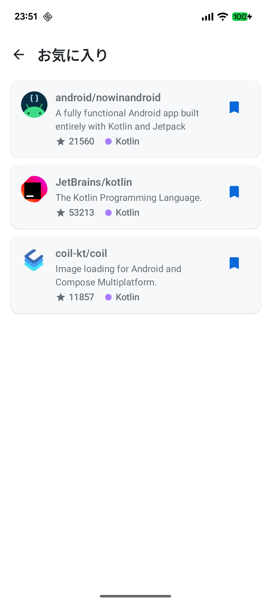
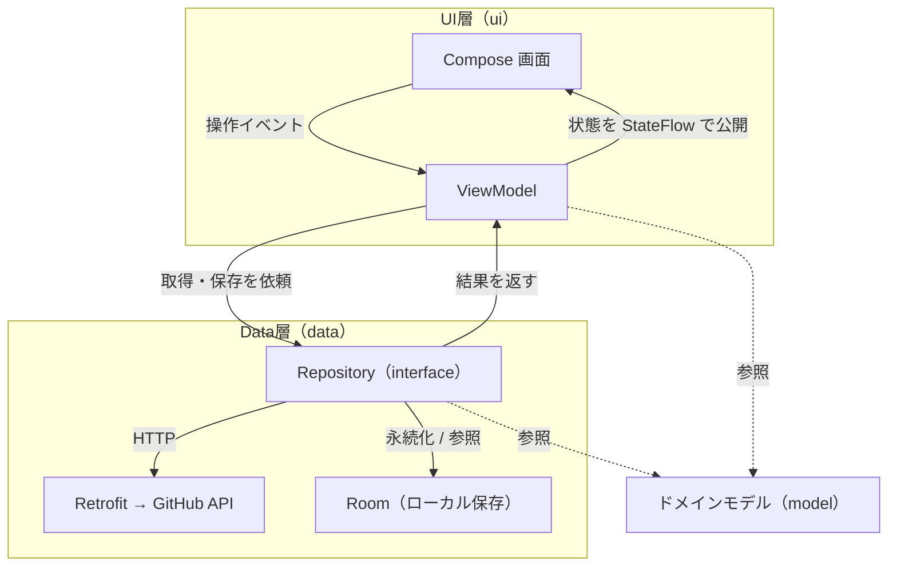

# GitHubリポジトリ検索アプリ

現行のAndroid標準構成（Jetpack Compose / Coroutines / Hilt / MVVM）で実装した、GitHubリポジトリ検索アプリ。

## デモ

| 主要機能（検索・無限スクロール・詳細・お気に入り）                  | テーマ切り替え・ブラウザで開く                                     |
|--------------------------------------------|-----------------------------------------------------|
|  |  |

## スクリーンショット

| 一覧                                                | 詳細                                                  | お気に入り                                                  |
|---------------------------------------------------|-----------------------------------------------------|--------------------------------------------------------|
|  |  |  |

## 主な機能

- キーワードでGitHubリポジトリを検索
- リポジトリ一覧表示（オーナーアイコン・言語・スター数）
- スクロールによる追加読み込み（無限スクロール）
- リポジトリ詳細画面への遷移
- お気に入り登録（端末内に保存し、オフラインでも閲覧可能）
- 検索履歴の保存・再利用
- ブラウザで開く
- テーマ切り替え（システム / ライト / ダーク）に対応（Material 3）

## 使用技術

| 分類      | 使用技術                                                                                                      |
|---------|-----------------------------------------------------------------------------------------------------------|
| 言語      | Kotlin                                                                                                    |
| UI      | Jetpack Compose（Material 3）                                                                               |
| 非同期     | Coroutines / Flow、StateFlow、SharedFlow                                                                    |
| アーキテクチャ | MVVM + 単方向データフロー（UDF）、UI / Data の2層 + ドメインモデル                                                             |
| DI      | Hilt（KSP）                                                                                                 |
| 通信      | Retrofit + kotlinx.serialization                                                                          |
| ローカル保存  | Room                                                                                                      |
| ページング   | 自前実装（ページ番号方式の追加読み込み）                                                                                      |
| 画像読み込み  | Coil                                                                                                      |
| 画面遷移    | Navigation Compose                                                                                        |
| テスト     | JUnit4 + kotlinx-coroutines-test / Robolectric                                                            |
| API     | [GitHub REST API（Search repositories）](https://docs.github.com/en/rest/search/search#search-repositories) |

## アーキテクチャ

Googleの[アプリ アーキテクチャ ガイド](https://developer.android.com/topic/architecture)を参考にUI /
Dataの2層へ分離し、両層が参照するライブラリ非依存のドメインモデルを`model`
に切り出している。ガイドのDomain層（ユースケース層）は任意のため、この規模では設けていない。



- UI層は実装ではなく `interface` に依存し、Hiltで実装を注入することで疎結合にする。
- ドメインモデルはAndroidや通信ライブラリの型に依存させず、UI層とData層の両方から参照する。
- 単方向データフロー（UDF）で、状態はViewModelから画面へ一方向に流す。

## 設計方針

- 通信の失敗はデータ層で吸収し、UI層はライブラリ非依存の結果だけを受け取る。（通信手段を差し替えても上位に波及させない）
- 画面状態はsealed interfaceで取りうる種類（読み込み中・成功・0件・エラーなど）に限定する。（表示漏れや不整合をコンパイル時に防ぐ）
- 検索をやり直すときは進行中の取得を打ち切る。ViewModelは前のJobをキャンセルし、データ層はキャンセルを通常のエラーとして握りつぶさず伝播させる。（遅れて返る古い結果や画面破棄後の更新で状態を壊さない）

## テスト

状態遷移・エラー変換・ページングといったロジックをAndroidに依存させず、JVMユニットテストで検証する（
`app/src/test`）。TDDで実装し、先に振る舞いを表すテストを書いてから最小限の実装で通す。

- ViewModelには応答タイミングを手動制御できるフェイクリポジトリを注入し、読み込み中 → 成功 / 0件 /
  エラー の状態遷移を検証する。
- 新しい検索が進行中の取得を打ち切ること（競合時に古い結果で新しい結果を上書きしないこと）を、フェイクの応答順を入れ替えて検証する。
- DTO → ドメイン変換・ページングの繰り上げ・エラーの分類を、それぞれ個別のテストで検証する。

## ビルドと実行

認証トークンの設定は不要（GitHubの公開検索APIを利用）。クローンしたリポジトリをAndroid
Studioで開き、実機/エミュレータ（minSdk
24 /
Android 7.0以上）で実行する。

```bash
./gradlew installDebug   # 接続中の端末にインストール
./gradlew test           # ユニットテスト
```
