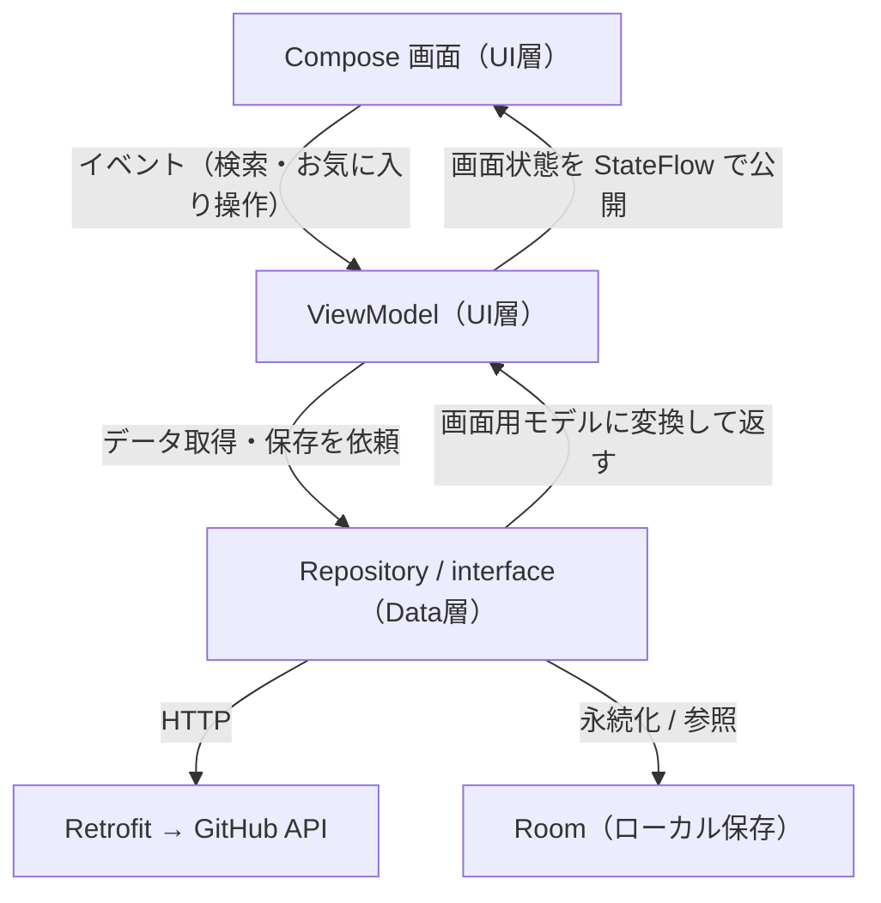

# GitHub リポジトリ検索アプリ

現行のAndroid標準構成（Jetpack Compose / Coroutines / Hilt / MVVM）で実装した、GitHubリポジトリ検索アプリ。

## スクリーンショット

<!-- TODO: 一覧・詳細・お気に入り画面のスクショ / 動作GIF -->
| 一覧 | 詳細 | お気に入り |
|---|---|---|
| (画像) | (画像) | (画像) |

## 主な機能

- キーワードでGitHubリポジトリを検索
- リポジトリ一覧表示（オーナーアイコン・言語・スター数・トピック）
- スクロールによる追加読み込み（無限スクロール）
- リポジトリ詳細画面への遷移
- お気に入り登録（端末内に保存し、オフラインでも閲覧可能）
- 検索履歴の保存・再利用
- ブラウザで開く / 共有
- ローディング / 0件 / エラー / 成功 の状態出し分け
- テーマ切り替え（システム / ライト / ダーク）に対応（Material 3）

## 技術スタック

| 分類 | 使用技術 |
|---|---|
| 言語 | Kotlin |
| UI | Jetpack Compose（Material 3） |
| 非同期 | Coroutines / Flow（StateFlow） |
| アーキテクチャ | MVVM + 単方向データフロー（UDF）、UI / Domain / Data の3層 |
| DI | Hilt（KSP） |
| 通信 | Retrofit + kotlinx.serialization |
| ローカル保存 | Room |
| ページング | 自前実装（ページ番号方式の追加読み込み） |
| 画像読み込み | Coil |
| 画面遷移 | Navigation Compose（型安全ナビゲーション） |
| テスト | JUnit4 + kotlinx-coroutines-test |
| API | GitHub REST API（Search repositories） |

## アーキテクチャ

Googleの「アプリ アーキテクチャ ガイド」に沿って UI / Domain / Data の3層に分離。

- UI層は実装ではなく `interface` に依存し、Hiltで実装を注入することで疎結合にする。
- 単方向データフロー（UDF）

## 設計方針

- 通信の失敗はデータ層で吸収し、UI層にはライブラリに依存しない結果として渡す。UI層は通信ライブラリの例外を直接扱わないため、通信手段を差し替えても上位に影響しない。
- 画面破棄などで処理がキャンセルされた際に確実に打ち切られるようにし、不要な更新やクラッシュを防ぐ。
- 新しい検索を開始すると進行中の検索を打ち切り、遅れて返った古い結果が新しい結果を上書きしないようにする。
- 画面状態を限定された種類（初期 / 読み込み中 / 成功 / 0件 / エラー）として表し、UIはそれに応じて表示を切り替える。
- 画面ロジックをAndroidに依存しない形にし、通信を伴わずに状態遷移やキャンセル挙動をユニットテストで検証する。
